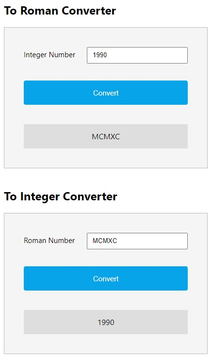

# Author - Hasan Colak

- [Github](https://github.com/hasancolak)
- [Linkedin](https://www.linkedin.com/in/hasan-colak-linkprofile/)
- [Medium](https://hasancolak.medium.com/)

# Roman Numerals Converter

This is simple React application converting from roman numerals to integer and from integer to roman numerals.

# Installation and Settup Instructions

In the project directory, you can run:

## Installation:

`npm install`

## To start a server:

`npm start`

## To visit the application:

Runs the app in the development mode.\
Open [http://localhost:3000](http://localhost:3000) to view it in the browser.

## To test the application:

`npm test`

Added the some basic unit test. Launches the test runner in the interactive watch mode.

## To build the application:

`npm run build`

Builds the app for production to the `build` folder.\
It correctly bundles React in production mode and optimizes the build for the best performance.

## Usage:

You will find out two box for conversion.

On the first box, you can type integer which is limited to the 3999 and click to the **Convert** button to see the result. When you typed bigger than 3999 you will get an error as invalid number.

On the second box, you can type string including **M,D,C,L,X,I,V** and click to the **Convert** button to see the result. When you typed different string you will get an error as invalid input.

# Guideline

## Tech Stack

- React.js
- Typescript
- React Hooks
- Sass

# Consideration and Decision

## Consideration

The largest number you can write in Roman numerals is 3,999 which is MMMCMXCIX. You can represent numbers larger than 3,999 in Roman numerals using an overline. An overline on a Roman numeral means you are multiplying that Roman numeral by 1,000. For the number 50,000 in Roman numerals you would use the Roman numeral L (50) with an overline to make it 50,000.

For example, L means 50 × 1,000 = 50,000. To enter 50,000 into this calculator as a Roman numeral enter \_L

## Design Principle and Code Quality

The separation of concerns (SoC) is one of the most fundamental principles in software development. It is so crucial that 2 out of 5 SOLID principles (Single Responsibility and Interface Segregation) are direct derivations from this concept.

## State Management Preferences

There ara several option adding global state management to the React application such as redux, hooks.

I have decided to added State and Custom hooks to the applicationb because of below reason:

- We can create stateful function component.
- Hooks let us split one component into smaller functions based on what pieces are related (such as setting up a subscription or fetching data),.
- Hooks allow us to reuse stateful logic without changing the component hierarchy
- Hooks let us use more of React’s features without classes

## Testing

TDD is one of the best practice of software development technique. In this project, I have just developed some basic tests integration.

On the other hand adding integration and e2e testing are also required practice of software development technique.

## Styling Preferences

I have implemented Sass stylesheet language to Control Scope With BEM Naming.

Advantage of using Sass with BEM library:

- It allow us to create reusable and non complex style codes.
- Sass suppots preprocessing, variable usage, nesting, partials, modules, mixin and more.

There is also other options for styling can be implemented like styled-components based on CSS-in-JS
